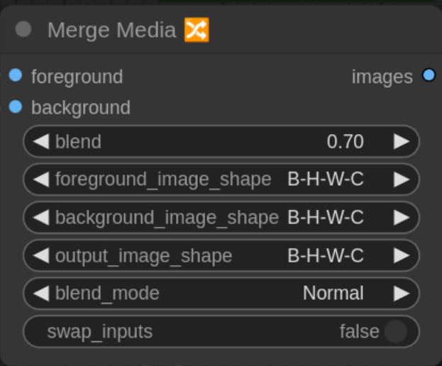

# ComfyUI Unified Media Suite - [Preview Beta]

Lightweight [PyAV](https://pypi.org/project/av/)-powered [ComfyUI](https://github.com/comfyanonymous/ComfyUI) nodes to load/save multimedia.


Based on the power of [ffmpeg](https://ffmpeg.org/), these nodes can be used to transcode media files at configurable sizes, degrees of quality, frame rates, etc. Create complex workflows by adding additional comfyui modules wired between any number of `Load Media` and `Save Media` nodes.

Features:

* Uses the [PyAV](https://pypi.org/project/av/) module, a fairly low-level Pythonic binding for [ffmpeg](https://ffmpeg.org/)'s libav library that offers a ton of control over image manipulation. This also means you do not need to separately install the command-line `ffmpeg`.

* Load single or multi-image **mp4**, **mov**, **webp**, **gif**, **apng**, **avi**, **.wmv**, **gif**, **png**, as well as audio files like **.mp3**, **aac**, and many more-- and provides audio and video to ComfyUI. 

* Saves to **.mp4**, **.mov**, **.webp**, **.gif**, **.apng**, **.avi**, **.wmv**, etc. (List is limited to the most popular to be manageable, but more can be enabled by overriding the input.) Plug in some video and sound, then choose your own pixel format and compression settings.

* On tests on Ubuntu, **.jpg** files aren't loading correctly, so you may want to just use the regular **Load Image** module or another module for that.  This seems to be an issue with the pyav release, but the cause is still to be determined.

* Preserves transparency (alpha channel) for video formats that support it (except for .gif which is weird as it doesn't use a real alpha channel-- it has to pick a single color in its palette to be transparent, and that gets really complicated).

Please ignore ComfyUI Unified Media Suite's unfortunate and entirely unintentional acronym.

## To install

1. Move this `comfyui-unified-media-suite` folder in `ComfyUI/custom_nodes`
2. Make sure you have the [PyAV](https://pypi.org/project/av/) module installed in your python environment. If needed, `pip install av` or use `conda` or whatever to install the `av` module. Note: If pip installs PyAV < 14.1.0 and you have an NVIDIA GPU, see the instructions in the FAQ below to add hardware-enhanced codecs.
3. Restart ComfyUI.

## Load Media node ("MediaLoad" class)


Imports a media file as a sequence of video and/or audio frames for further handling by a ComfyUI workflow.

### Input:

* **media_filename** -- _required_ -- A media file. File types supported include .**mp4**, .**mov**, .**wmv**, .**gif**, and more. There's a lot of them. The file will be loaded by ffmpeg, so consult with its documentation for a list.

* **output_image_shape** -- _required_ -- Should the output images be shaped like Batch, Height, Width, Channels? Or Batch, Channels, Height Weight? You decide!

* **batch_size** -- _required_ -- if you use a GPU, such as CUDA, this says how many images to try to fit into the GPU at once for faster processing. Experiment with larger sizes and the file should load faster. Pick too big of a number and you may have crash when your VRAM fills up.

* **frame_offset** -- _optional_ -- This allows you to skip a number of video frames. Audio will attempt to match the same starting point selected here, but it may not be exact. Leave 0 for no offset. 

* **frame_count** -- _optional_ -- This setting selects how many video frames to include in the output (starting at the `frame_offset` discussed above). Again, the audio will do a best-approximation of the `frame_count`. Leave 0 to load to the end of the media_file, or wherever it runs out of video frames.

### Outputs:


* **images** -- image frames from the first video stream in the file as a ComfyUI batched image tensor. If it exists, the alpha channel will be included.

* **audio** -- audio from in the first audio stream in the file, also per ComfyUI for piping into other nodes.

* **fps** -- a best-guess of frames-per-second. Note that some formats may support variable fps. Animated GIFs, for example, may have an arbitrary delay between each frame. Single images have a fps of 0

* **width** -- the width of the video images.

* **height** -- the height of the video images.

* **num_frames** -- this is a total count of frames exported. Single images have a count of 1.

* **duration** -- a calculated best-guess as to the running time (in seconds) for the video. Single images have a duration of 0.

* **audio_sample_rate** -- the number of audio samples-per-second. Common values are 44100 or 48000.

## Save Media node ("MediaSave" class)


Exports frames and/or audio to a media file.

### Input

* **filename_prefix** -- _required_ -- Example: If you put `Video` here with a mp4 **format**, the files will be saved something like `Video00001.mp4`. The next time you save it will be `Video00002.mp4` etc.


* **format** -- _required_ -- To keep this list from being gigantic, I selected what I felt was the most popular container and file formats. This list can be expanded by adding formats to the list in the `SaveMedia.py` file.


* **video_codec** -- _required_ -- `ffmpeg` supports a lot of codecs too, and not every codec fits in every container. If you get an error, try, try again. This is ignored for non-containers like GIF.


* **audio_codec** -- _required_ -- Ditto. Default is 'aac'. Ignored if audio isn't being used.

* **pix_fmt** -- _required_ -- Similarly, every codec supports a subset of these pixel formats. For some formats, if you don't choose a valid `pix_fmt`, a sane default will be chosen for you, especially when alpha channels are used. Get a list of which pixel formats support which codec if you have ffmpeg installed with this `ffmpeg` CLI command: `ffmpeg -h encoder=codec_name`

* **fps** -- _required_ -- This defaults to `24.0`, but you can override the default or even transform this to an input socket and pipe in a frame rate from somewhere else. (This is a float value, but will be internally represented as a fraction with `fps*100000` as the numerator an `100000` as a denominator to preserve 8 decimal digits. This will allow accuracy in frame rates such as 23.976)

* **audio_sample_rate** -- _required_ -- the number of audio samples-per-second. Common values are 44100 or 48000. Defaults to 48000. Only used if relevant.

* **crf** -- _required_ -- Constant Rate Factor -- A quantizer, where 0 is lossless quality (8-bit only), 51 is worst quality. Applies to H264 x264 encoder. See [here](https://trac.ffmpeg.org/wiki/Encode/H.264) for more info. Ignored if not applicable.


* **preset** -- _required_ -- See [here](https://trac.ffmpeg.org/wiki/Encode/H.264) for explanation. Ignored if not applicable.


* **tune** -- _required_ -- See [here](https://trac.ffmpeg.org/wiki/Encode/H.264) for explanation. Ignored if not applicable.

#### Optional

* **images** -- this is the source of images. Optional, but include either this or **audio** so there's something to save.

* **audio** -- this is the source for audio. Optional, but include this either this or **images** so there's something to save.

* **width** -- If left at 0, this will default to the width of the incoming video frames. Otherwise, it will override, so you can use this to save a differently-sized image. Does nothing if there's no images, obviously.

* **height** -- Similar to **width**, if left at 0, this will default to the height of the incoming video frames and can also be used for resizing.

* **input_image_shape** -- Should the input images be shaped like Batch, Height, Width, Channels? Or Batch, Channels, Height Weight? You decide!

* **save_metadata** -- Attempts to save prompt & workflow metadata in the media file. Not all formats can save metadata, and **pyav** doesn't support every format that DOES support metadata (or at least I haven't figured out how to do it), but **mp4**, **mov**, **flac**, **mp3**, and others seem to work. To view the metadata, check the EXIF data with something like **exiftool** or using a media player like **VLC**. Formats like `flac` should even allow you to drag/drop the file to comfyui to automatically load the workflow, and mp4 and mov should have the metadata in the **Comment** exif field.

### Output

The **MediaSave** module saves its output to a file specified in **filename_prefix** (with a number to make it unique) in ComfyUI's `output` folder.


## Merge Media node ("MediaMerge" class)



Modeled somewhat after the "merge" node in DaVinci Resolve, this composites two videos-- a foreground atop a background. You can choose a "blend" for partial overlay.

If the image sizes are not the same, the foreground will be stretched or compressed to match the background.

If the frame count is not the same, the shorter video will repeat to pad itself to the longer video. The frame rate is not taken into account, so avoid mis-=aligning frame rates.

Note that the **Merge Media** node can also be used to resize images as the output will always be scaled to fit the background node.

### Input

* **blend** -- _required_ -- what amount of the foreground should be blended over the background. A value of 1.0 will overlay 100% (except for the alpha value). **If you iteratively change the blend per-image, you can create dissolves between videos or, if the foreground contains text with a transparent alpha, you can fade-in captions, etc.** You will need to do each frame one at a time, each with a new blend value. Different rates-of-change for the blend value could result in ease-in, ease-out, etc.

* **foreground** -- _required_ -- some images, with or without alpha channel, to be composited OVER the background.

* **background** -- _required_ -- some images, with or without alpha channel, to be composited UNDER the foreground.

* **foreground_image_shape** -- _required_ -- Should this foreground input be shaped like Batch, Height, Width, Channels? Or Batch, Channels, Height Weight?

* **background_image_shape** -- _required_ -- Should the background input be shaped like Batch, Height, Width, Channels? Or Batch, Channels, Height Weight?

* **output_image_shape** -- _required_ -- Should the output images be shaped like Batch, Height, Width, Channels? Or Batch, Channels, Height Weight?


* **blend_mode** -- _required_ -- An attempt to implement different [blend modes](https://en.wikipedia.org/wiki/Blend_modes). This may have issues, but you can play around with it. The alpha channels of the background and foreground are blended identically regardless of the mode you choose.

* **swap_inputs** -- _required_ -- A convenient option adopted from DaVinci Resolve, this lets you reverse the foreground and background, which may be useful for experimenting with different blend modes.

### Output

Should be obvious. Note that this is just outputting a bunch of images, so there's no frame rate or anything- that would come back into play later like when saving back to a media file.

## FAQ

### Why is video saved at the wrong frame rate?

Try adjusting the FPS manually or piping the fps output from **MediaLoad** directly to **MediaSave** for a consistent speed.

### Why is the sound at the wrong speed?

The waveform for the audio is generated when the sound is loaded. Check that the video is playing at an expected rate or the sound may slow down with it.

### The composition in Media Merge looks screwy and isn't what I expected!

It's very possible the blending formulas are implemented wrong, but one thing that may help is to free the model and node cache, which you can do with the ComfyUI Manager.

### Why is Media Merge slow?

This is because of the memory required to do the merges entirely in VRAM. Currently, you have to load the FOREGROUND in its entirety, the BACKGROUND in its entirety, the ALPHA channels, and the shorter of the foreground and background must be padded so that they are the same length in frames, with the shorter one "looping' to match the longer one. This tends to blow up GPU memory if it's all done there, so for now regular CPU memory is used. The blending is a bit slower this way-- so a solution might be to copy a bunch of frames into the GPU, then composite them super quick, then copy the result back to regular memory (replacing the existing background frames as it goes along to re-use space). The thing is, the copying to-and-from gpu memory itself has a time cost, and I haven't done a lot of experimenting to see if the fast-GPU compositing would outweigh the slower memory moving. I'm guessing it *WOULD* be worth it, but I just haven't tried it.

### What happens if I break all the rules and try to save an image as a MP3 or even better, 100 images into a single png file?!

Bad things.

# How do I get NVIDIA NVENC/NVDEC GPU acceleration?

[This is available to PyAV as of Dec 17, 2024](https://github.com/PyAV-Org/PyAV/commit/2c63608a349e9f1f5de702071100bb0c8d268860) (PyAV version 14.1.0 -- details [here](https://github.com/PyAV-Org/PyAV/pull/1685)), but for many distributions, it not available through pip yet (as of this writing). GPU-accelerated AV1 support is in the [works](https://github.com/PyAV-Org/PyAV/discussions/1691) too for newer CUDA hardware.

If you can't wait for it to show up on its own, you can [build the python module yourself today](https://github.com/PyAV-Org/PyAV#alternative-installation-methods). If you're using an older version of Linux such as Ubuntu 24.04, the instructions below will show you what minor changes to make.

You can also bring in your own version of FFMPEG [following these instructions](https://pyav.basswood-io.com/docs/stable/overview/installation.html?highlight=install).

When you have gpu support enabled, the video codec list should look a little bit longer:


Keep in mind your video card may not support all codecs. For example, AV1 hardware encoding is only supported on recent Nvidia hardware.

#### Build the PyAV module w/nvenc Nvidia hardware support on Ubuntu 24.10 (1/17/25)

Mostly follow the [instructions](https://github.com/PyAV-Org/PyAV#alternative-installation-methods) from the PyAV page, but here are a few extra things you need to do:

Install some headers and build-tools with:

`sudo apt install libavformat-dev libavdevice-dev build-essential cmake`

Ubuntu 24.04 uses an older version of FFMPEG, so you'll want to tell the build script:

`export PYAV_LIBRARY=ffmpeg-6.1`

and you'll need to make two additions to headers. First, go to

`/usr/include/x86_64-linux-gnu/libavutil/hwcontext.h` and add `AV_HWDEVICE_TYPE_D3D12VA` to the list on line 40 or so.

Then add the contents of [this file](https://ffmpeg.org/doxygen/7.0/hwcontext__d3d12va_8h_source.html) to a new file you create at `/usr/include/x86_64-linux-gnu/libavutil/hwcontext_d3d12va.h`

At this point you can follow the rest of the instructions. You can use `pip wheel .` to build a file like `av-14.1.0-cp312-cp312-linux_x86_64.whl` that can be installed onto other machines.

To automate the above, you'd do something like the following (if you have the build-tools already set up and have a python3 virtual environment at `/opt/venv/`). 

```bash
# get the library/headers & virtualenv as required by the pyav build script
sudo apt install -y libavformat-dev libavdevice-dev virtualenv
# ensure the headers are in place as required by the pyav build script
curl https://raw.githubusercontent.com/FFmpeg/FFmpeg/refs/heads/master/libavutil/hwcontext_d3d12va.h \
      /usr/include/x86_64-linux-gnu/libavutil/hwcontext_d3d12va.h && \
sed -i '40 i AV_HWDEVICE_TYPE_D3D12VA,' /usr/include/x86_64-linux-gnu/libavutil/hwcontext.h
# now get the latest pyav source and build it in /tmp then install
# the .whl file to your virtual environment (/opt/venv in this example)
export PYAV_LIBRARY=ffmpeg-6.1 && cd /tmp && \
git clone https://github.com/PyAV-Org/PyAV.git && \
cd /tmp/PyAV && export PYAV_LIBRARY=ffmpeg-6.1 && source \
   /tmp/PyAV/scripts/activate.sh && make && source /opt/venv/bin/activate && \
cd /opt/venv && pip install /tmp/PyAV/
```

Now you should have the `hevc_nvenc`, `av1_nvenc`, etc. codecs. Once these are added to the official pyav releases on your distribution, the above should not be needed.

## Ideas for improvement (PRs wanted!)

* Realtime iltering/restricting UI to appropriate FFMPEG options to limit your choices to, say, only legal `pix_fmt`s.
* GPU support for **Media Merge** if it adds performance.
* Add a media player to **MediaSave**.
* To that end, add a * **MediaPreview** similar to image preview for all formats ffmpeg supports.
* Support for more video and audio streams rather than one each.
* Add an **Upload** button to **MediaLoad**.
* Create **MediaTransform**, a pass-through application of FFMPEG's audio and video [filters](https://ffmpeg.org/ffmpeg-filters.html). These could be chained together in series or could have combos in a single node.